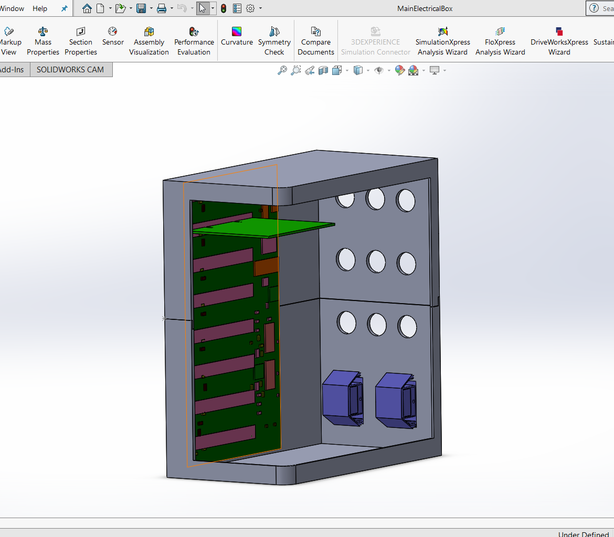
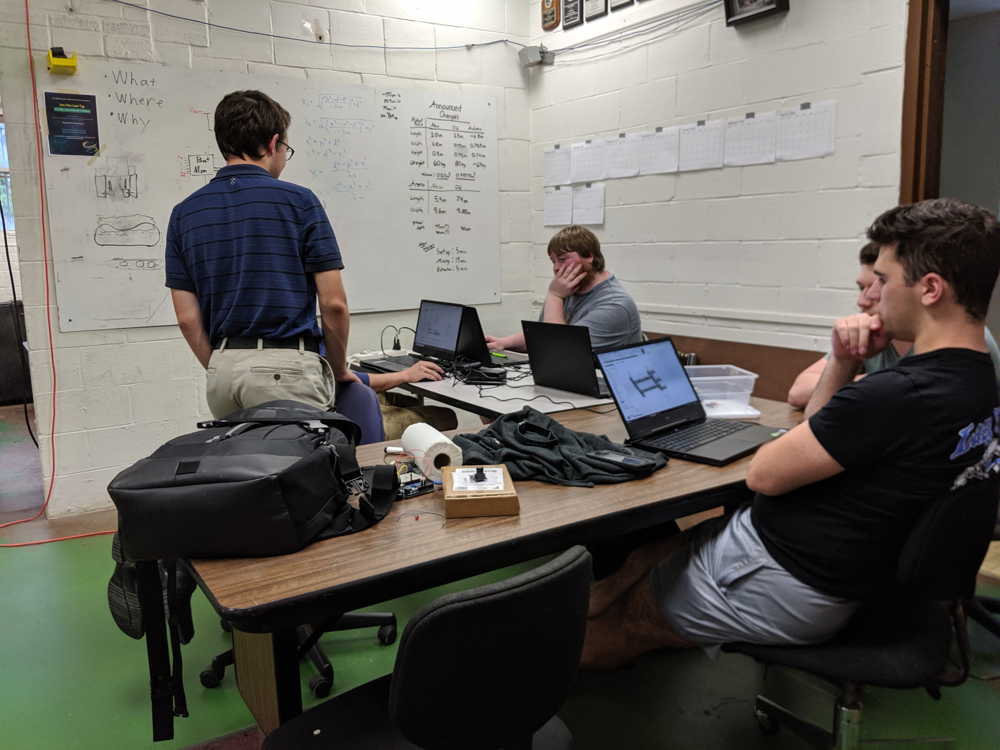
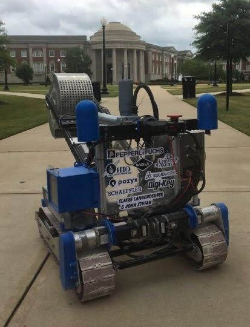

Title: About the Competition
Date: 2023-10-11
Authors: Roobots
Summary: About the NASA lunabotics competition

# What Is Our Competition?

The NASA Robotic Mining Competition: Lunabotics is a university student design competition based on NASA’s Artemis Moon to Mars mission. The goal of this competition is to build a robot that can navigate obstacles and excavate icy regolith, or ice chunks, in a simulated lunar environment. The competition consists of three phases: Design It, Build It, and Dig It.

## Phase I: Design It

In the first phase, we plan for the year and design our robot using 3D modeling CAD software. The key deliverables for this phase are the Project Management Plan and the Executive Summary.

The Project Management Plan includes:

- Our schedule for the year
- Our budget for material and travel costs
- The parts of our design that we want to optimize, such as autonomy or collection of icy regolith
- Technical performance measures that help us manage critical elements of our design, such as mass, size, or bandwidth
  We also write our Executive Summary:

- High-level summary of our project that describes our design and goals
- Includes a 3D CAD model of our robot design

## Phase II: Build It

In Phase II, we actually get to build our robot! This is where much of our hard work is put in, from machining parts and assembling the frame, to soldering and wiring, to writing code!

Key deliverables for this phase include the Systems Engineering Paper, Slide Presentation, and Public Outreach Project Report. We also create a Proof of Life video showing our robot in action!

#### Slide Presentation:

This is a presentation that we make to the judges while at competition describing:

- Project management
- Safety plan
- Performance goals
- Robot design and testing
- Innovation from prior years' designs
  Proof of Life Video
  This video shows our robot in action performing two digging cycles. Click here to see our 2019 proof of life video!

#### Public Outreach Project Report:

In this paper, we describe our outreach efforts over the course of the year. For more information on our outreach, click here.

- What outreach was done
- Who participated
- How it inspired students to learn about STEM
- What demographic was reached

#### Systems Engineering Paper

This paper demonstrates how our team uses the systems engineering process in designing, building, and testing our robot. Click here for more information about systems engineering. The paper has two main sections:

- Project Management Merit: This section details design optimization criteria, design reviews, work schedule, cost budget, and how our design has changed from the previous year.
- Systems Engineering Merit: This section describes the concept of operations, system hierarchy, interfaces, requirements, Technical Performance Measurements, trade studies, reliability, and system requirements verification.

### Phase III: Dig It

Phase III is the climax of our year of work! Active members of the team get to travel to Kennedy Space Center in Florida for a week and compete with 50 universities across the US. In this phase, the robot gets two 15-minute competition runs to mine in the arena and excavate as much icy regolith simulant (gravel) as possible. Each competition run is scored based on the following criteria:

- Safety inspection
- Amount of gravel mined
- Average data bandwidth used
- Camera bandwidth used
- Mining robot mass
- Energy consumed
- Dust tolerant design
- Dust free operation
- Autonomy

