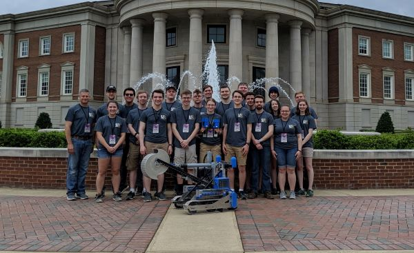
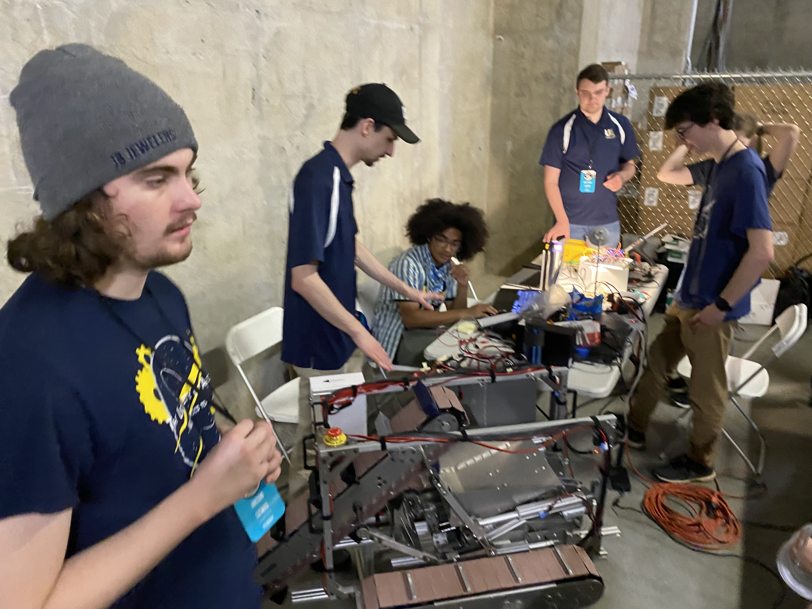

Title: Homepage
Date: 2023-10-11
slug: index
Authors: Roobots
Summary: Homepage for the University of Akron Robotics Club

## Who We Are

The NASA Robotic Mining Team is a student-led engineering design team that designs and builds an autonomous robot for lunar mining. The robot’s design purpose is to traverse and mine in a simulated lunar environment collecting materials 30 cm beneath the surface. Every May, team members spend a week at NASA’s Kennedy Space Center in Florida, where the robot competes against robots built by approximately 50 other teams from other universities all over the US. The team is also focused strongly on K-12 STEM outreach, especially to underrepresented students.

### New Members

Are you a University of Akron student? Are you interested in joining our team?
[Click here to learn more about joining the team.](./new-members.html)

### Sponsors

Do you represent a company? Would your company like to sponsor our team?
[Reach out to us here.](./contact.html)

### Outreach

Do you work with K-12 students? Would you like the team to present to your group?
[See our outreach page here.](./outreach.html)

<!-- How high is jacob lmao??-->
