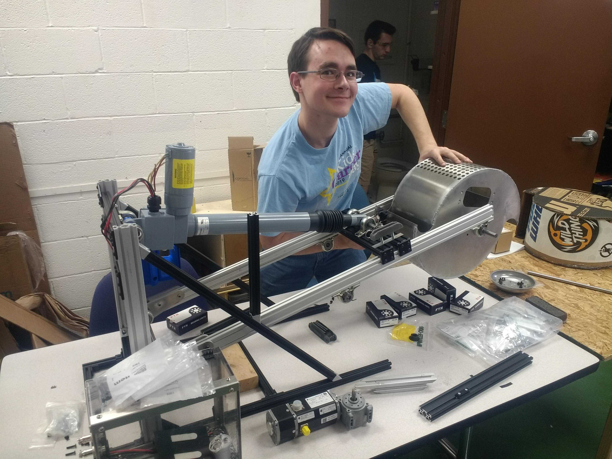
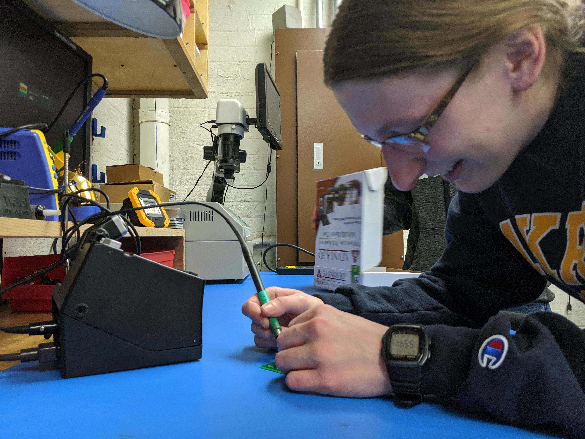
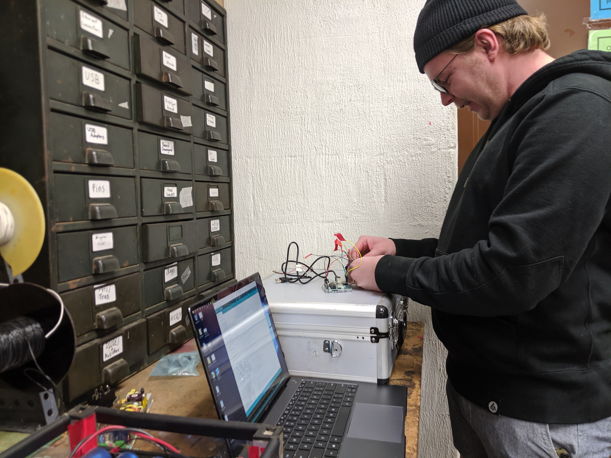

Title: New Members
Date: 2023-10-11
Authors: Roobots
Summary: Overview of the University of Akron NASA Robotics team for new members.

## Welcome to the University of Akron NASA Robotics Team!

Our team is made up of three sub-teams: mechanical, electrical, and software. You can join whichever team matches your interests, regardless of major! The mechanical team focuses on the overall physical design, starting with modeling in SolidWorks and ending with machining parts and assembling the robot. The electrical team designs all circuit boards in-house using CAD software, as well the wiring for the robot. The software team writes all of the code for the robot, mainly in C++, with the goal of making the robot run autonomously.

We are making an effort for overall design strategy to be a to be a team wide task, as every sub-team has their own unique perspective on the robot. Mechanical team members may be the first ones working on a robot design, but everyone on the team has a say in the design process. We are also making an effort to have more collaboration between the sub-teams, so that everyone has a chance to learn about the other sub-teams and how they work together.

_As a member of the team you’ll have the opportunity to learn valuable design and hands-on skills that are highly desired by employers!_

## Mechanical

Every mechanical component on our robot is designed by students on our team. As a member of the mechanical team, we will teach you how to use SolidWorks to 3D model components. Once your component has been modeled, you will 3D print a prototype or machine the part! You will also be a vital part of the assembly and testing of the robot. Here are some of the other skills you will learn as a mechanical:

- 3D Modeling
- Prototyping
- 3D Printing
- System Integration
- Motor Specification
- Machining
- Welding
- Robot Manufacturing and Assembly

## Electrical

As a member of the electrical team, we will teach you how to design and build the entire electrical system of the robot, from circuit boards to batteries to meters of wiring! You will start by learning how to use our printed circuit board design software. We will guide you through the process of designing, laying out, and routing the board. Once the design is complete, the board will be ordered, and we will teach you how to solder components and test your circuit board! You will also be an integral part of wiring and testing the electrical system of the robot. Here are some of skills you can expect to learn through our team:

- Schematic Design
- Circuit Board Design
- Understanding of Circuit Components
- Soldering
- Power Management
- Reading Datasheets
- Hardware Interfacing
- Wiring Harness Design and Construction

## Software

The software team is responsible for the “brains” of the robot: all the code that makes it run! On the software team, we will teach you how to code in C and C++. Once you have an understanding of coding, you will learn how to use C++ to program the microprocessors on our circuit boards designed by the electrical team. We will also teach you algorithm design and implementation, as we work toward the goal of a fully autonomous robot! Here are some of the skills the software team learns:

- Embedded C++ Programming
- Python Programming
- Algorithm Design
- Hardware Interfacing
- Embedded Communication Protocols
- Image Processing
- Programming for Autonomy

