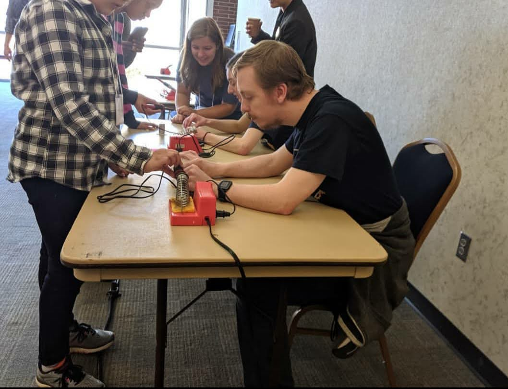
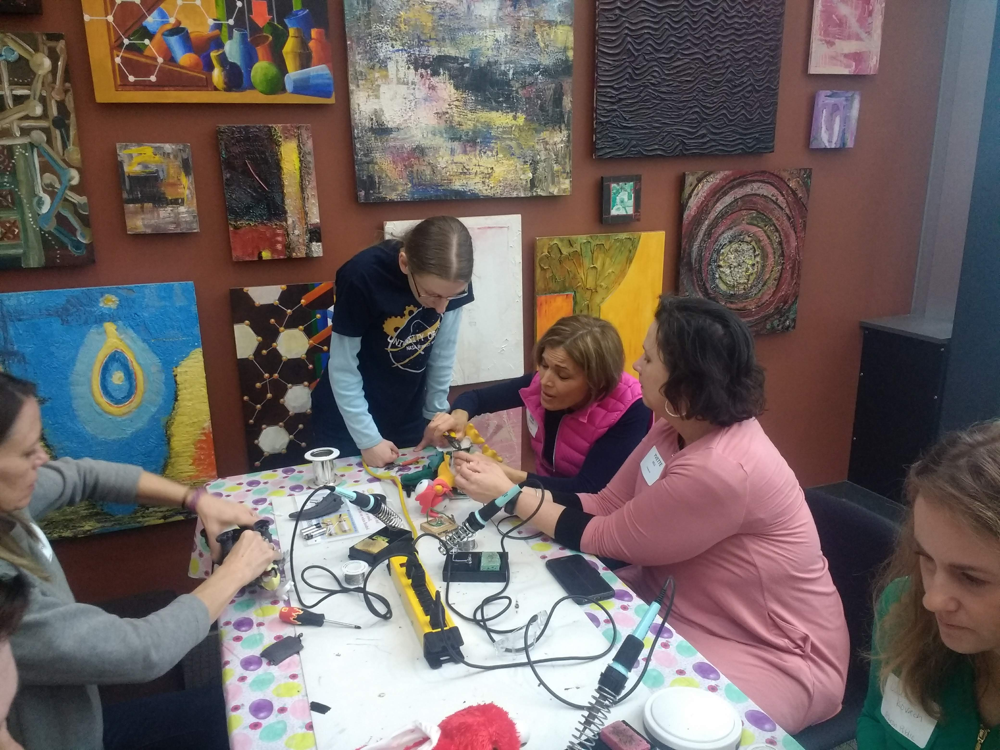

Title: Outreach
Date: 2023-10-11
Authors: Roobots
Summary: Our Teams Outreach Efforts

This year (2023), we are helping out with a variety of outreach events, including:

- Make a Difference Day
- Firestone High School VEX VRC Competition
- Brecksville-Broadview Heights High School VEX VRC Competition

### Make a Difference Day

RePlay for kids is an amazing non-profit that repairs electronic toys for children. In helping with make a difference day for Replay will be hands on with soldering and giving back to the community around us!

### VRC Competitions

We are helping out with two VEX VRC Competitions this year. We will be helping with the setup and teardown of the competition, as well as helping with the competition itself. This includes positions such as We will also be bringing our robot to the competition to show off to the students!

### Past Outreach Events

Here are some of our past outreach events!

We help out with Women in Engineering K-12 Programs events at the University of Akron throughout the year, such as Kids Career Day and Inquire! Innovate! Invent!

At Replay for Kids, we modified electronic toys for children with disabilities.

Through the Inclusioneers, the team has adapted the electrical systems on Power Wheels "Wild Thing" vehicles for children with disabilities.

