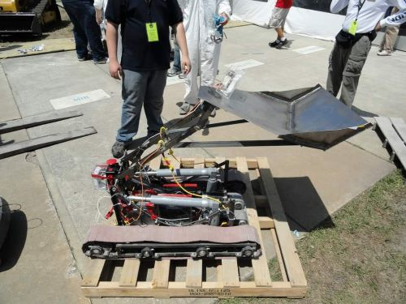
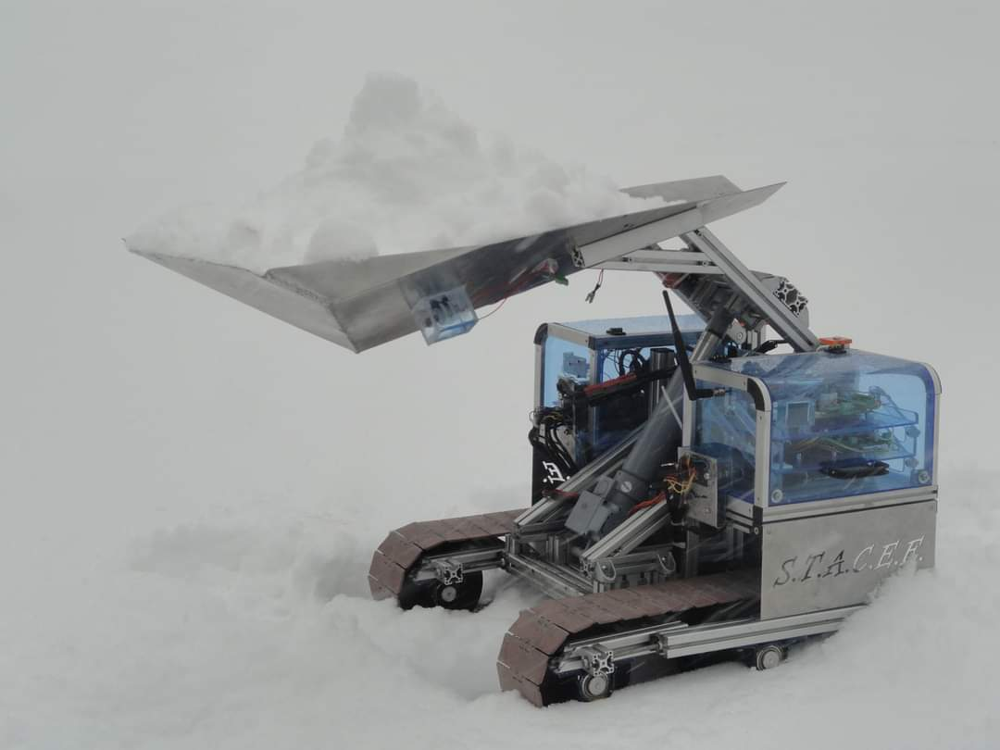
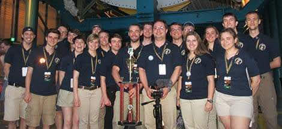
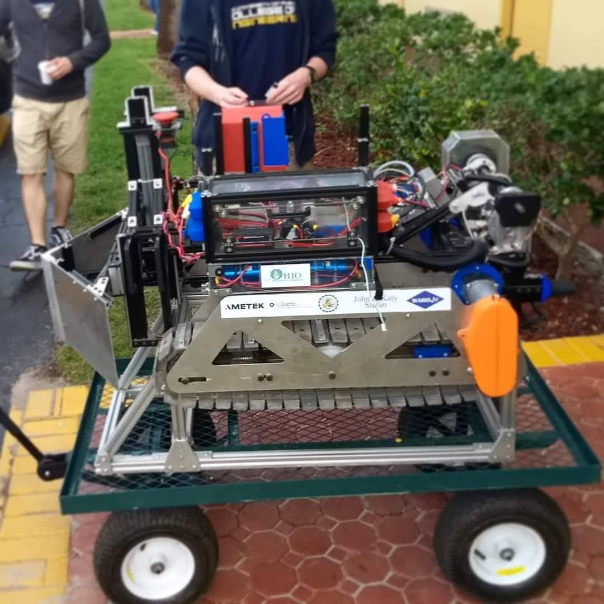
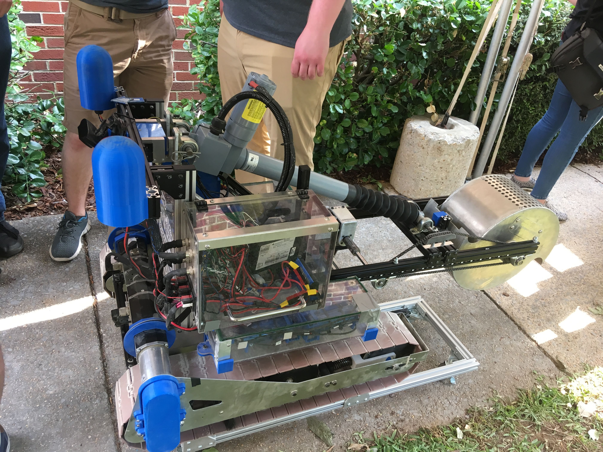

Title: Our History
Date: 2023-10-11
Authors: Roobots
Summary: The history of the University of Akron NASA Robotics team

_The Akron NASA Robotics team has competed every year NASA has hosted the competition. Here are a few highlights from the last 12 years!_

Here is our very first robot, PiRATE (Piloted Robotic All Terrain Excavator), who placed 6th out of 44 teams competing. We’ve come a long way since then, but you can still see similarities with our recent robots!

In 2013 our robot STACEE (Systematic Technicial Automaton Collecting Extraterrestrial Elements) placed 10th out of 50 teams. The team also won 3rd place in the slide presentation!

In 2016 the team won the Efficient Use of Communication Power Award for lowest average data bandwidth per points earned based on quantities of regolith mined.

Our 2018 robot, ROCKEE (Robust Operational Collector Kinematically Excavating Elements), placed 5th out of 44 teams competing! We also won third place for both outreach and our systems engineering paper!

In 2019 the team placed 2nd out of 46 teams in the NASA competition, with 1st place in outreach and 4th place in systems engineering! Here is our 2019 robot AuDREE (Autonomous Drum Rotating Extraterrestrial Excavator).

Some competition years were unfortunately lost to the COVID-19 pandemic, but we are back and ready to compete in 2023 with our new robot, FLAREE (Fully Loaded Autonomous Regolith Excavator and Extractor)!
